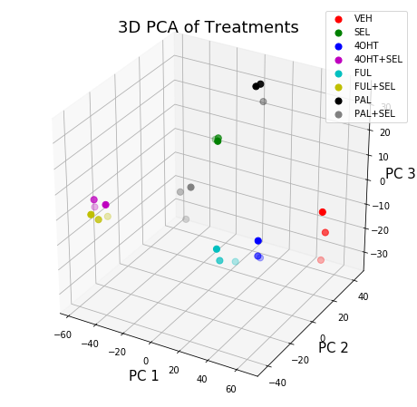

# PCA Analysis of Breast Cancer Gene Expression Data by Treatment

## By Brandi Smith

The data for this analysis was generated after breast cancer cells were treated in vitro with several treatments. RNA sequencing analysis and gene set enrichment analysis (GSEA) followed. 


```python
#import pandas module to read data as dataframe
import pandas as pd

#import os module to get and change directories
import os
os.getcwd()

#change directory to location of file
#os.chdir("Documents")

#read data into python using pandas
df=pd.read_table("Exp_GSEA.txt")

#look at first few rows of data
df.head()

#observe names of columns in data frame
list(df.columns)

#remove the ensembl id from the list of column names
features=list(df.columns)
features.remove("Ensembl ID")

#transpose the data
df=df.transpose()

df.head()


```


<div>
<style scoped>
    .dataframe tbody tr th:only-of-type {
        vertical-align: middle;
    }

    .dataframe tbody tr th {
        vertical-align: top;
    }

    .dataframe thead th {
        text-align: right;
    }
</style>
<table border="1" class="dataframe">
  <thead>
    <tr style="text-align: right;">
      <th></th>
      <th>0</th>
      <th>1</th>
      <th>2</th>
      <th>3</th>
      <th>4</th>
      <th>5</th>
      <th>6</th>
      <th>7</th>
      <th>8</th>
      <th>9</th>
      <th>...</th>
      <th>6532</th>
      <th>6533</th>
      <th>6534</th>
      <th>6535</th>
      <th>6536</th>
      <th>6537</th>
      <th>6538</th>
      <th>6539</th>
      <th>6540</th>
      <th>6541</th>
    </tr>
  </thead>
  <tbody>
    <tr>
      <td>Ensembl ID</td>
      <td>ENSG00000000460</td>
      <td>ENSG00000000971</td>
      <td>ENSG00000001461</td>
      <td>ENSG00000001617</td>
      <td>ENSG00000002726</td>
      <td>ENSG00000002745</td>
      <td>ENSG00000003096</td>
      <td>ENSG00000003137</td>
      <td>ENSG00000003400</td>
      <td>ENSG00000003436</td>
      <td>...</td>
      <td>ENSG00000284284</td>
      <td>ENSG00000284343</td>
      <td>ENSG00000284411</td>
      <td>ENSG00000284413</td>
      <td>ENSG00000284415</td>
      <td>ENSG00000284435</td>
      <td>ENSG00000284458</td>
      <td>ENSG00000284473</td>
      <td>ENSG00000284541</td>
      <td>ENSG00000284564</td>
    </tr>
    <tr>
      <td>V1</td>
      <td>1.11775</td>
      <td>-0.0838324</td>
      <td>-0.566755</td>
      <td>-0.347182</td>
      <td>-1.18923</td>
      <td>-0.977043</td>
      <td>0.663699</td>
      <td>0.553682</td>
      <td>-0.941488</td>
      <td>-0.861333</td>
      <td>...</td>
      <td>-0.478749</td>
      <td>-0.400659</td>
      <td>-0.97894</td>
      <td>-0.0420578</td>
      <td>-0.698589</td>
      <td>-1.45865</td>
      <td>0.563521</td>
      <td>1.10347</td>
      <td>0.286716</td>
      <td>0.0147626</td>
    </tr>
    <tr>
      <td>V2</td>
      <td>1.03704</td>
      <td>-0.0838324</td>
      <td>-0.393348</td>
      <td>-0.321135</td>
      <td>-0.0714734</td>
      <td>0.582548</td>
      <td>0.751255</td>
      <td>0.41314</td>
      <td>-0.366877</td>
      <td>-0.960881</td>
      <td>...</td>
      <td>0.0659878</td>
      <td>-1.24301</td>
      <td>0.3427</td>
      <td>-0.648855</td>
      <td>-0.283891</td>
      <td>0.0344616</td>
      <td>-0.199755</td>
      <td>-0.843758</td>
      <td>-0.879693</td>
      <td>0.833221</td>
    </tr>
    <tr>
      <td>V3</td>
      <td>1.08383</td>
      <td>0.205488</td>
      <td>-0.781605</td>
      <td>-0.485208</td>
      <td>-0.597132</td>
      <td>1.65799</td>
      <td>0.328514</td>
      <td>0.670989</td>
      <td>-1.52997</td>
      <td>-0.803397</td>
      <td>...</td>
      <td>-0.666193</td>
      <td>-0.658153</td>
      <td>-0.436526</td>
      <td>-1.61989</td>
      <td>-0.00487155</td>
      <td>-1.45865</td>
      <td>0.474679</td>
      <td>1.35152</td>
      <td>-1.08401</td>
      <td>0.408077</td>
    </tr>
    <tr>
      <td>S1</td>
      <td>-0.408479</td>
      <td>-0.0838324</td>
      <td>-0.0557966</td>
      <td>-0.405557</td>
      <td>0.389624</td>
      <td>2.76667</td>
      <td>-0.00985336</td>
      <td>-0.131593</td>
      <td>0.96298</td>
      <td>-0.0636301</td>
      <td>...</td>
      <td>0.889033</td>
      <td>0.915319</td>
      <td>0.468785</td>
      <td>0.310674</td>
      <td>1.48273</td>
      <td>-0.577948</td>
      <td>0.709514</td>
      <td>-0.237352</td>
      <td>0.210253</td>
      <td>-0.0147629</td>
    </tr>
  </tbody>
</table>
<p>5 rows × 6542 columns</p>
</div>


```python
#drop first row of data frame

df=df.drop(df.index[0])
df.head()
```


<div>
<style scoped>
    .dataframe tbody tr th:only-of-type {
        vertical-align: middle;
    }

    .dataframe tbody tr th {
        vertical-align: top;
    }

    .dataframe thead th {
        text-align: right;
    }
</style>
<table border="1" class="dataframe">
  <thead>
    <tr style="text-align: right;">
      <th></th>
      <th>0</th>
      <th>1</th>
      <th>2</th>
      <th>3</th>
      <th>4</th>
      <th>5</th>
      <th>6</th>
      <th>7</th>
      <th>8</th>
      <th>9</th>
      <th>...</th>
      <th>6532</th>
      <th>6533</th>
      <th>6534</th>
      <th>6535</th>
      <th>6536</th>
      <th>6537</th>
      <th>6538</th>
      <th>6539</th>
      <th>6540</th>
      <th>6541</th>
    </tr>
  </thead>
  <tbody>
    <tr>
      <td>V1</td>
      <td>1.11775</td>
      <td>-0.0838324</td>
      <td>-0.566755</td>
      <td>-0.347182</td>
      <td>-1.18923</td>
      <td>-0.977043</td>
      <td>0.663699</td>
      <td>0.553682</td>
      <td>-0.941488</td>
      <td>-0.861333</td>
      <td>...</td>
      <td>-0.478749</td>
      <td>-0.400659</td>
      <td>-0.97894</td>
      <td>-0.0420578</td>
      <td>-0.698589</td>
      <td>-1.45865</td>
      <td>0.563521</td>
      <td>1.10347</td>
      <td>0.286716</td>
      <td>0.0147626</td>
    </tr>
    <tr>
      <td>V2</td>
      <td>1.03704</td>
      <td>-0.0838324</td>
      <td>-0.393348</td>
      <td>-0.321135</td>
      <td>-0.0714734</td>
      <td>0.582548</td>
      <td>0.751255</td>
      <td>0.41314</td>
      <td>-0.366877</td>
      <td>-0.960881</td>
      <td>...</td>
      <td>0.0659878</td>
      <td>-1.24301</td>
      <td>0.3427</td>
      <td>-0.648855</td>
      <td>-0.283891</td>
      <td>0.0344616</td>
      <td>-0.199755</td>
      <td>-0.843758</td>
      <td>-0.879693</td>
      <td>0.833221</td>
    </tr>
    <tr>
      <td>V3</td>
      <td>1.08383</td>
      <td>0.205488</td>
      <td>-0.781605</td>
      <td>-0.485208</td>
      <td>-0.597132</td>
      <td>1.65799</td>
      <td>0.328514</td>
      <td>0.670989</td>
      <td>-1.52997</td>
      <td>-0.803397</td>
      <td>...</td>
      <td>-0.666193</td>
      <td>-0.658153</td>
      <td>-0.436526</td>
      <td>-1.61989</td>
      <td>-0.00487155</td>
      <td>-1.45865</td>
      <td>0.474679</td>
      <td>1.35152</td>
      <td>-1.08401</td>
      <td>0.408077</td>
    </tr>
    <tr>
      <td>S1</td>
      <td>-0.408479</td>
      <td>-0.0838324</td>
      <td>-0.0557966</td>
      <td>-0.405557</td>
      <td>0.389624</td>
      <td>2.76667</td>
      <td>-0.00985336</td>
      <td>-0.131593</td>
      <td>0.96298</td>
      <td>-0.0636301</td>
      <td>...</td>
      <td>0.889033</td>
      <td>0.915319</td>
      <td>0.468785</td>
      <td>0.310674</td>
      <td>1.48273</td>
      <td>-0.577948</td>
      <td>0.709514</td>
      <td>-0.237352</td>
      <td>0.210253</td>
      <td>-0.0147629</td>
    </tr>
    <tr>
      <td>S2</td>
      <td>-0.262493</td>
      <td>2.06886</td>
      <td>0.0429049</td>
      <td>-0.405164</td>
      <td>-0.0556846</td>
      <td>2.80036</td>
      <td>0.0970764</td>
      <td>-0.272989</td>
      <td>0.97084</td>
      <td>-0.287226</td>
      <td>...</td>
      <td>-0.279197</td>
      <td>0.57005</td>
      <td>1.12895</td>
      <td>-0.378</td>
      <td>1.39155</td>
      <td>-0.194922</td>
      <td>0.599256</td>
      <td>0.241764</td>
      <td>0.352124</td>
      <td>0.0945797</td>
    </tr>
  </tbody>
</table>
<p>5 rows × 6542 columns</p>
</div>


```python
#this module is loaded to scale our features 
from sklearn.preprocessing import StandardScaler
# Standardizing the features
x = StandardScaler().fit_transform(df)

```


```python
#import PCA from sklearn.decomoposition to peform PCA analysis
from sklearn.decomposition import PCA
pca = PCA(n_components=3)
principalComponents = pca.fit_transform(df)
principalDf = pd.DataFrame(data = principalComponents
             , columns = ['principal component 1',
                          'principal component 2',
                         'principal component 3'])
```


```python
principalDf
```


<div>
<style scoped>
    .dataframe tbody tr th:only-of-type {
        vertical-align: middle;
    }

    .dataframe tbody tr th {
        vertical-align: top;
    }

    .dataframe thead th {
        text-align: right;
    }
</style>
<table border="1" class="dataframe">
  <thead>
    <tr style="text-align: right;">
      <th></th>
      <th>principal component 1</th>
      <th>principal component 2</th>
      <th>principal component 3</th>
    </tr>
  </thead>
  <tbody>
    <tr>
      <td>0</td>
      <td>64.445531</td>
      <td>20.443697</td>
      <td>-3.189914</td>
    </tr>
    <tr>
      <td>1</td>
      <td>65.306393</td>
      <td>22.512752</td>
      <td>-12.162742</td>
    </tr>
    <tr>
      <td>2</td>
      <td>63.063486</td>
      <td>22.139661</td>
      <td>-23.730241</td>
    </tr>
    <tr>
      <td>3</td>
      <td>-20.922571</td>
      <td>31.579632</td>
      <td>8.738992</td>
    </tr>
    <tr>
      <td>4</td>
      <td>-18.335176</td>
      <td>31.036691</td>
      <td>9.877089</td>
    </tr>
    <tr>
      <td>5</td>
      <td>-17.274136</td>
      <td>29.295949</td>
      <td>9.392261</td>
    </tr>
    <tr>
      <td>6</td>
      <td>50.351784</td>
      <td>-17.187215</td>
      <td>-8.525536</td>
    </tr>
    <tr>
      <td>7</td>
      <td>48.432994</td>
      <td>-16.729462</td>
      <td>-2.282837</td>
    </tr>
    <tr>
      <td>8</td>
      <td>49.664415</td>
      <td>-18.452892</td>
      <td>-7.422961</td>
    </tr>
    <tr>
      <td>9</td>
      <td>-52.489410</td>
      <td>-33.529405</td>
      <td>1.442247</td>
    </tr>
    <tr>
      <td>10</td>
      <td>-45.206339</td>
      <td>-32.749460</td>
      <td>3.188723</td>
    </tr>
    <tr>
      <td>11</td>
      <td>-52.803379</td>
      <td>-33.604343</td>
      <td>4.346596</td>
    </tr>
    <tr>
      <td>12</td>
      <td>39.438397</td>
      <td>-38.265902</td>
      <td>-2.685043</td>
    </tr>
    <tr>
      <td>13</td>
      <td>36.971505</td>
      <td>-37.825563</td>
      <td>1.245207</td>
    </tr>
    <tr>
      <td>14</td>
      <td>46.432339</td>
      <td>-33.715903</td>
      <td>-3.809786</td>
    </tr>
    <tr>
      <td>15</td>
      <td>-42.725512</td>
      <td>-41.299542</td>
      <td>1.102129</td>
    </tr>
    <tr>
      <td>16</td>
      <td>-46.729926</td>
      <td>-42.698482</td>
      <td>2.990536</td>
    </tr>
    <tr>
      <td>17</td>
      <td>-39.977773</td>
      <td>-37.019706</td>
      <td>1.069488</td>
    </tr>
    <tr>
      <td>18</td>
      <td>11.303028</td>
      <td>34.107023</td>
      <td>27.652968</td>
    </tr>
    <tr>
      <td>19</td>
      <td>9.531360</td>
      <td>33.700357</td>
      <td>34.418730</td>
    </tr>
    <tr>
      <td>20</td>
      <td>7.829221</td>
      <td>31.863936</td>
      <td>33.901805</td>
    </tr>
    <tr>
      <td>21</td>
      <td>-48.118429</td>
      <td>42.155504</td>
      <td>-19.308119</td>
    </tr>
    <tr>
      <td>22</td>
      <td>-50.898679</td>
      <td>40.835564</td>
      <td>-32.990325</td>
    </tr>
    <tr>
      <td>23</td>
      <td>-57.289123</td>
      <td>43.407109</td>
      <td>-23.259268</td>
    </tr>
  </tbody>
</table>
</div>


```python
#convert list of features to dataframe 
features=['VEH','VEH','VEH','SEL','SEL','SEL',
         '4OHT','4OHT','4OHT', '4OHT+SEL', '4OHT+SEL',
         '4OHT+SEL', 'FUL','FUL','FUL', 'FUL+SEL',
          'FUL+SEL','FUL+SEL','PAL','PAL','PAL',
          'PAL+SEL','PAL+SEL','PAL+SEL']
features=pd.DataFrame(features, columns=['Treatment'])
```


```python
#final dataframe before plotting
finalDf = pd.concat([principalDf, features],axis=1)
```


```python
finalDf
```


<div>
<style scoped>
    .dataframe tbody tr th:only-of-type {
        vertical-align: middle;
    }

    .dataframe tbody tr th {
        vertical-align: top;
    }

    .dataframe thead th {
        text-align: right;
    }
</style>
<table border="1" class="dataframe">
  <thead>
    <tr style="text-align: right;">
      <th></th>
      <th>principal component 1</th>
      <th>principal component 2</th>
      <th>principal component 3</th>
      <th>Treatment</th>
    </tr>
  </thead>
  <tbody>
    <tr>
      <td>0</td>
      <td>64.445531</td>
      <td>20.443697</td>
      <td>-3.189914</td>
      <td>VEH</td>
    </tr>
    <tr>
      <td>1</td>
      <td>65.306393</td>
      <td>22.512752</td>
      <td>-12.162742</td>
      <td>VEH</td>
    </tr>
    <tr>
      <td>2</td>
      <td>63.063486</td>
      <td>22.139661</td>
      <td>-23.730241</td>
      <td>VEH</td>
    </tr>
    <tr>
      <td>3</td>
      <td>-20.922571</td>
      <td>31.579632</td>
      <td>8.738992</td>
      <td>SEL</td>
    </tr>
    <tr>
      <td>4</td>
      <td>-18.335176</td>
      <td>31.036691</td>
      <td>9.877089</td>
      <td>SEL</td>
    </tr>
    <tr>
      <td>5</td>
      <td>-17.274136</td>
      <td>29.295949</td>
      <td>9.392261</td>
      <td>SEL</td>
    </tr>
    <tr>
      <td>6</td>
      <td>50.351784</td>
      <td>-17.187215</td>
      <td>-8.525536</td>
      <td>4OHT</td>
    </tr>
    <tr>
      <td>7</td>
      <td>48.432994</td>
      <td>-16.729462</td>
      <td>-2.282837</td>
      <td>4OHT</td>
    </tr>
    <tr>
      <td>8</td>
      <td>49.664415</td>
      <td>-18.452892</td>
      <td>-7.422961</td>
      <td>4OHT</td>
    </tr>
    <tr>
      <td>9</td>
      <td>-52.489410</td>
      <td>-33.529405</td>
      <td>1.442247</td>
      <td>4OHT+SEL</td>
    </tr>
    <tr>
      <td>10</td>
      <td>-45.206339</td>
      <td>-32.749460</td>
      <td>3.188723</td>
      <td>4OHT+SEL</td>
    </tr>
    <tr>
      <td>11</td>
      <td>-52.803379</td>
      <td>-33.604343</td>
      <td>4.346596</td>
      <td>4OHT+SEL</td>
    </tr>
    <tr>
      <td>12</td>
      <td>39.438397</td>
      <td>-38.265902</td>
      <td>-2.685043</td>
      <td>FUL</td>
    </tr>
    <tr>
      <td>13</td>
      <td>36.971505</td>
      <td>-37.825563</td>
      <td>1.245207</td>
      <td>FUL</td>
    </tr>
    <tr>
      <td>14</td>
      <td>46.432339</td>
      <td>-33.715903</td>
      <td>-3.809786</td>
      <td>FUL</td>
    </tr>
    <tr>
      <td>15</td>
      <td>-42.725512</td>
      <td>-41.299542</td>
      <td>1.102129</td>
      <td>FUL+SEL</td>
    </tr>
    <tr>
      <td>16</td>
      <td>-46.729926</td>
      <td>-42.698482</td>
      <td>2.990536</td>
      <td>FUL+SEL</td>
    </tr>
    <tr>
      <td>17</td>
      <td>-39.977773</td>
      <td>-37.019706</td>
      <td>1.069488</td>
      <td>FUL+SEL</td>
    </tr>
    <tr>
      <td>18</td>
      <td>11.303028</td>
      <td>34.107023</td>
      <td>27.652968</td>
      <td>PAL</td>
    </tr>
    <tr>
      <td>19</td>
      <td>9.531360</td>
      <td>33.700357</td>
      <td>34.418730</td>
      <td>PAL</td>
    </tr>
    <tr>
      <td>20</td>
      <td>7.829221</td>
      <td>31.863936</td>
      <td>33.901805</td>
      <td>PAL</td>
    </tr>
    <tr>
      <td>21</td>
      <td>-48.118429</td>
      <td>42.155504</td>
      <td>-19.308119</td>
      <td>PAL+SEL</td>
    </tr>
    <tr>
      <td>22</td>
      <td>-50.898679</td>
      <td>40.835564</td>
      <td>-32.990325</td>
      <td>PAL+SEL</td>
    </tr>
    <tr>
      <td>23</td>
      <td>-57.289123</td>
      <td>43.407109</td>
      <td>-23.259268</td>
      <td>PAL+SEL</td>
    </tr>
  </tbody>
</table>
</div>


```python
#plotting pca
import matplotlib.pyplot as plt
from mpl_toolkits import mplot3d
```


```python
fig = plt.figure(figsize = (8,8))
ax = fig.add_subplot(111, projection='3d') 
ax.set_xlabel('PC 1', fontsize = 15)
ax.set_ylabel('PC 2', fontsize = 15)
ax.set_zlabel('PC 3', fontsize = 15)
ax.set_title('3D PCA of Treatments', fontsize = 18)
treatments = ['VEH','SEL','4OHT', '4OHT+SEL', 'FUL',
            'FUL+SEL','PAL', 'PAL+SEL']
colors = ['r', 'g', 'b','m','c','y','k','grey']
for Treatment, color in zip(treatments,colors):
    indicesToKeep = finalDf['Treatment'] == Treatment
    ax.scatter(finalDf.loc[indicesToKeep, 'principal component 1']
               , finalDf.loc[indicesToKeep, 'principal component 2']
               , finalDf.loc[indicesToKeep, 'principal component 3']
               , c = color
               , s = 50)
ax.legend(treatments)
ax.grid()

plt.show()


```





### Explained Variance


```python
pca.explained_variance_ratio_
```


    array([0.3894952 , 0.21335509, 0.05145895])


Nearly 60% of the variation in treatments is due to principle components 1 and 2.


```python
finalDf.to_csv("listPCs.csv")

```


```python

```
